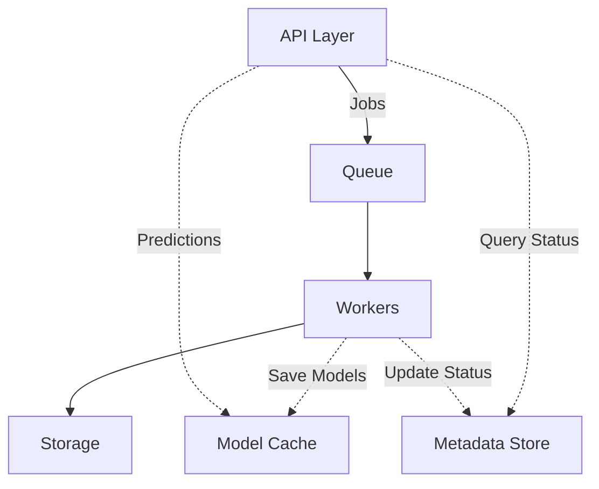

# plexe

A docker container for creating and running machine learning models using the [plexe](https://github.com/plexe-ai/plexe) library.

> **Warning**: This is an early alpha release. Expect bugs and limitations. More features are coming in future releases!

## Overview

plexe provides a comprehensive API-driven solution for building, managing, and deploying machine learning models with minimal code. It transforms the capabilities of plexe into a platform that supports:

- Natural language model definition
- Automated model training and evaluation
- RESTful prediction endpoints
- Simple model management

## Quick Start

### Prerequisites

- Docker and Docker Compose
- An API key for an LLM provider (OpenAI, Anthropic, etc.)

### Setup

1. Clone the repository:
```bash
git clone https://github.com/plexe-ai/plexe.git
cd docker
```

2. Configure your environment:
```bash
cp .env.example .env
# Edit .env with your LLM provider API key
```

3. Start the services:
```bash
docker-compose up -d
```

4. Access the platform:
   - API: http://localhost:8000
   - Web UI: http://localhost:8501

### Web UI

The included Streamlit-based web interface provides an easy way to:
- Create models using a simple form interface
- View all your models and their status
- Make predictions using your trained models

### Create Your First Model via API

```bash
curl -X POST http://localhost:8000/models \
  -H "Content-Type: application/json" \
  -d '{
    "intent": "Predict heart attack risk",
    "input_schema": {
      "age": "int",
      "cholesterol": "float",
      "exercise": "bool"
    },
    "output_schema": {
      "heart_attack": "bool"
    }
  }'
```

### Make a Prediction

```bash
curl -X POST http://localhost:8000/predictions/models/{model_id} \
  -H "Content-Type: application/json" \
  -d '{"data": {"age": 65, "cholesterol": 280.0, "exercise": false}}'
```

> **Warning**: This is an early alpha release. Expect bugs and limitations. More features are coming in future releases!

## Architecture



### Components

- **API Layer**: FastAPI-powered REST interface for model management and predictions
- **Queue**: Redis-based job queue for processing model build requests
- **Workers**: Python workers for model training and evaluation
- **Storage**: MongoDB for model metadata and job information
- **Model Cache**: File-based storage for trained models

## API Reference

### Models

- `POST /models`: Create a new model
- `GET /models/{model_id}`: Get model metadata
- `GET /models`: List all models

### Predictions

- `POST /predictions/models/{model_id}`: Make a prediction

### Jobs

- `GET /jobs/{job_id}`: Get job status
