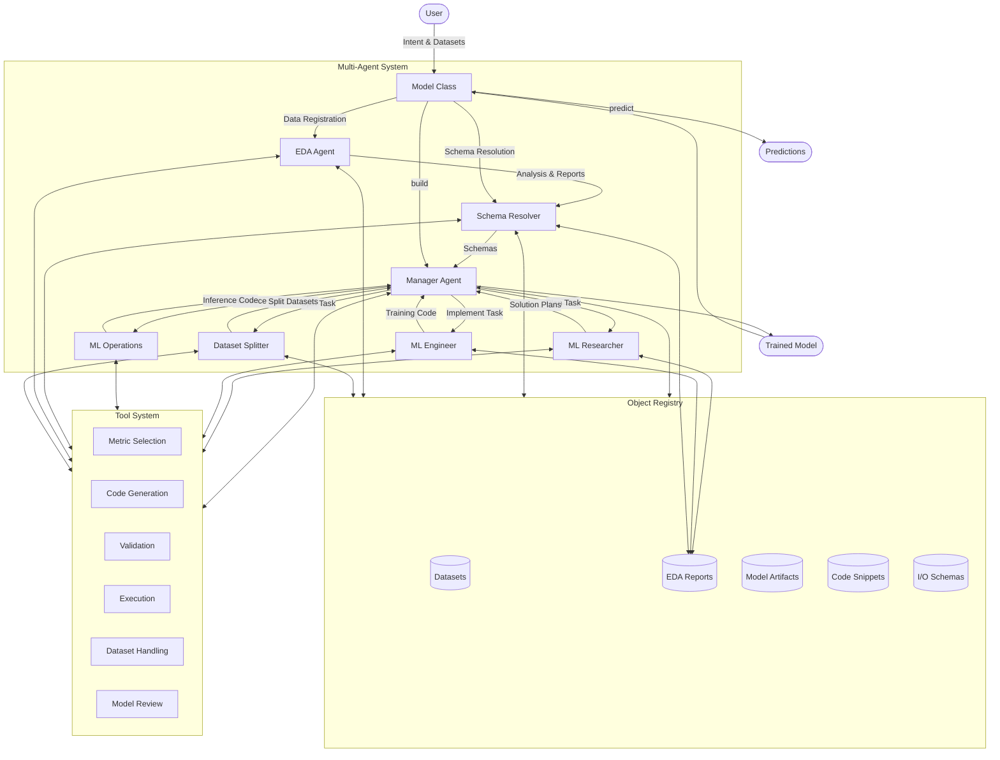

# Plexe Multi-Agent Architecture

<div align="center">

*A framework for autonomous machine learning using specialized agents*
</div>

## 📚 Table of Contents

- [Overview](#overview)
- [Architecture Diagram](#architecture-diagram)
- [Key Components](#key-components)
  - [EDA Agent](#eda-agent)
  - [Schema Resolver Agent](#schema-resolver-agent)
  - [Dataset Splitter Agent](#dataset-splitter-agent)
  - [Manager Agent (Orchestrator)](#manager-agent-orchestrator)
  - [ML Research Scientist Agent](#ml-research-scientist-agent)
  - [ML Engineer Agent](#ml-engineer-agent)
  - [ML Operations Engineer Agent](#ml-operations-engineer-agent)
  - [Object Registry](#object-registry)
  - [Tool System](#tool-system)
- [Workflow](#workflow)
- [Implementation Details](#implementation-details)
- [Extending the System](#extending-the-system)
- [References](#references)

## Overview

Plexe employs a sophisticated multi-agent architecture to automate the end-to-end machine learning development process. Instead of relying on a single large language model (LLM) to handle all aspects of ML development, Plexe uses a team of specialized agents, each designed for specific tasks in the ML lifecycle.

This approach offers several advantages:
- **Specialization**: Each agent focuses on what it does best
- **Modularity**: Components can be improved or replaced independently
- **Scalability**: The system can handle increasingly complex ML tasks
- **Explainability**: Clear separation of concerns helps trace decisions

## Architecture Diagram



## Key Components

### EDA Agent

**Class**: `EdaAgent`
**Type**: `CodeAgent`

The EDA Agent performs exploratory data analysis on datasets early in the workflow:

```python
eda_agent = EdaAgent(
    model_id=provider_config.research_provider,
    verbose=verbose,
    chain_of_thought_callable=cot_callable,
)
```

**Responsibilities**:
- Analyzing datasets to understand structure, distributions, and relationships
- Identifying data quality issues, outliers, and missing values
- Generating key insights about the data
- Providing recommendations for preprocessing and modeling
- Registering EDA reports in the Object Registry for use by downstream agents

### Schema Resolver Agent

**Class**: `SchemaResolverAgent`
**Type**: `CodeAgent`

The Schema Resolver Agent infers input and output schemas from intent and dataset samples:

```python
schema_resolver = SchemaResolverAgent(
    model_id=provider_config.orchestrator_provider,
    verbose=verbose,
    chain_of_thought_callable=cot_callable,
)
```

**Responsibilities**:
- Analyzing the problem description and sample data
- Inferring appropriate input and output schemas
- Registering schemas with the Object Registry
- Providing automatic schema resolution when schemas aren't specified

### Dataset Splitter Agent

**Class**: `DatasetSplitterAgent`
**Type**: `CodeAgent`

The Dataset Splitter Agent handles the intelligent partitioning of datasets:

```python
dataset_splitter_agent = DatasetSplitterAgent(
    model_id=orchestrator_model_id,
    verbose=verbose,
    chain_of_thought_callable=chain_of_thought_callable,
)
```

**Responsibilities**:
- Analyzing datasets to determine appropriate splitting strategies
- Handling specialized splitting needs (time-series, imbalanced data)
- Creating train/validation/test splits with proper stratification
- Registering split datasets in the Object Registry for downstream use

### Manager Agent (Orchestrator)

**Class**: `PlexeAgent.manager_agent`  
**Type**: `CodeAgent`

The Manager Agent serves as the central coordinator for the entire ML development process:

```python
self.manager_agent = CodeAgent(
    name="Orchestrator",
    model=LiteLLMModel(model_id=self.orchestrator_model_id),
    tools=[
        get_select_target_metric(self.tool_model_id),
        get_review_finalised_model(self.tool_model_id),
        create_input_sample,
        format_final_orchestrator_agent_response,
    ],
    managed_agents=[self.ml_research_agent, self.dataset_splitter_agent, self.mle_agent, self.mlops_engineer],
    add_base_tools=False,
    verbosity_level=self.orchestrator_verbosity,
    additional_authorized_imports=config.code_generation.authorized_agent_imports,
    max_steps=self.max_steps,
    prompt_templates=get_prompt_templates("code_agent.yaml", "manager_prompt_templates.yaml"),
    planning_interval=7,
    step_callbacks=[self.chain_of_thought_callable],
)
```

**Responsibilities**:
- Initializing the problem based on user intent
- Selecting appropriate metrics
- Coordinating specialist agents
- Making decisions about which solution approach to pursue
- Collecting and integrating the final model artifacts

### ML Research Scientist Agent

**Class**: `PlexeAgent.ml_research_agent`  
**Type**: `ToolCallingAgent`

This agent specializes in solution planning and strategy:

```python
self.ml_research_agent = ToolCallingAgent(
    name="MLResearchScientist",
    description=(
        "Expert ML researcher that develops detailed solution ideas and plans for ML use cases. "
        "To work effectively, as part of the 'task' prompt the agent STRICTLY requires:"
        "- the ML task definition (i.e. 'intent')"
        "- input schema for the model"
        "- output schema for the model"
        "- the name and comparison method of the metric to optimise"
        "- the name of the dataset to use for training"
    ),
    model=LiteLLMModel(model_id=self.ml_researcher_model_id),
    tools=[get_dataset_preview, get_eda_report],
    add_base_tools=False,
    verbosity_level=self.specialist_verbosity,
    prompt_templates=get_prompt_templates("toolcalling_agent.yaml", "mls_prompt_templates.yaml"),
    step_callbacks=[self.chain_of_thought_callable],
)
```

**Responsibilities**:
- Analyzing the problem and available datasets
- Brainstorming possible ML approaches
- Developing detailed solution plans
- Providing rationales for suggested approaches

### ML Engineer Agent

**Class**: `ModelTrainerAgent`  
**Type**: `CodeAgent`

This agent handles the implementation and training of models:

```python
self.mle_agent = ModelTrainerAgent(
    ml_engineer_model_id=self.ml_engineer_model_id,
    tool_model_id=self.tool_model_id,
    distributed=self.distributed,
    verbose=verbose,
    chain_of_thought_callable=self.chain_of_thought_callable,
).agent
```

**Responsibilities**:
- Generating training code based on solution plans
- Training models and evaluating performance
- Handling data preprocessing
- Troubleshooting and fixing issues
- Creating model artifacts

### ML Operations Engineer Agent

**Class**: `PlexeAgent.mlops_engineer`  
**Type**: `CodeAgent`

This agent focuses on productionizing the model through inference code:

```python
self.mlops_engineer = CodeAgent(
    name="MLOperationsEngineer",
    description=(
        "Expert ML operations engineer that analyzes training code and creates high-quality production-ready "
        "inference code for ML models. To work effectively, as part of the 'task' prompt the agent STRICTLY requires:"
        "- input schema for the model"
        "- output schema for the model"
        "- the 'training code id' of the training code produced by the MLEngineer agent"
    ),
    model=LiteLLMModel(model_id=self.ml_ops_engineer_model_id),
    tools=[
        get_inference_context_tool(self.tool_model_id),
        validate_inference_code,
        format_final_mlops_agent_response,
    ],
    add_base_tools=False,
    verbosity_level=self.specialist_verbosity,
    additional_authorized_imports=config.code_generation.authorized_agent_imports + ["plexe", "plexe.*"],
    prompt_templates=get_prompt_templates("code_agent.yaml", "mlops_prompt_templates.yaml"),
    planning_interval=8,
    step_callbacks=[self.chain_of_thought_callable],
)
```

**Responsibilities**:
- Generating inference code for trained models
- Implementing model loading logic
- Creating input preprocessing and output postprocessing
- Validating inference code correctness

### Object Registry

**Class**: `ObjectRegistry`

The Object Registry provides a shared repository for storing and retrieving objects across the multi-agent system:

```python
class ObjectRegistry:
    """
    Registry for storing and retrieving objects by name.

    This class implements the Singleton pattern so that registry instances are shared
    across the application. It provides methods for registering, retrieving, and
    managing objects in a type-safe manner.
    """

    _instance = None
    _items = {}

    def __new__(cls):
        if cls._instance is None:
            cls._instance = super(ObjectRegistry, cls).__new__(cls)
            cls._items = {}
        return cls._instance
```

**Key Features**:
- Type-safe storage and retrieval
- Shared access across agents
- Registration of multiple item types (datasets, artifacts, code, schemas)
- Batch operations with register_multiple and get_multiple

### Tool System

The system includes specialized tools that agents can use to perform specific tasks, implemented using factory patterns:

**Metric Selection Tool**:
```python
def get_select_target_metric(model_id: str) -> Callable:
    """Factory function that returns a tool for selecting appropriate target metrics."""
    @tool
    def select_target_metric(task: str) -> Dict:
        """Selects the appropriate target metric to optimise for the given task."""
```

**Code Generation Tools**:
```python
def get_training_code_generation_tool(llm_to_use: str) -> Callable:
    """Factory function that returns a tool for generating training code."""
    @tool
    def generate_training_code(
        task: str, solution_plan: str, train_datasets: List[str], 
        validation_datasets: List[str]
    ) -> str:
        """Generates training code based on the solution plan."""
```

**Dataset Tools**:
```python
@tool
def register_split_datasets(
    dataset_names: List[str],
    train_datasets: List[pd.DataFrame],
    validation_datasets: List[pd.DataFrame],
    test_datasets: List[pd.DataFrame],
) -> Dict[str, List[str]]:
    """Register train, validation, and test datasets in the object registry."""
```

**Execution Tools**:
```python
def get_executor_tool(distributed: bool) -> Callable:
    """Factory function that returns the appropriate executor tool."""
    if distributed:
        return execute_training_code_distributed
    return execute_training_code
```

## Workflow

The multi-agent workflow follows these key steps:

1. **Initialization**:
   - User creates a `Model` instance with intent and datasets
   - User calls `model.build()` to start the process

2. **Exploratory Data Analysis**:
   - EdaAgent analyzes datasets to understand structure and characteristics
   - Generates insights about data patterns, quality issues, and modeling considerations
   - EDA reports are registered in the Object Registry for use by other agents

3. **Schema Resolution**:
   - If schemas aren't provided, SchemaResolverAgent infers them
   - The agent can leverage EDA findings to determine appropriate schemas
   - Schemas are registered in the Object Registry

4. **Orchestration**:
   - Manager Agent selects metrics and coordinates the process
   - Manager Agent initializes the solution planning phase

5. **Dataset Splitting**:
   - Dataset Splitter Agent analyzes data characteristics
   - Creates appropriate train/validation/test splits
   - Registers split datasets in the Object Registry

6. **Solution Planning**:
   - ML Research Scientist proposes solution approaches
   - Manager Agent evaluates and selects approaches

7. **Model Implementation**:
   - ML Engineer generates and executes training code
   - Model artifacts are registered in the Object Registry
   - Process may iterate through multiple approaches

8. **Inference Code Generation**:
   - ML Operations Engineer generates compatible inference code
   - Code is validated with sample inputs

9. **Finalization**:
   - Manager Agent reviews and finalizes the model
   - All artifacts and code are collected
   - Completed model is returned to the user

## Implementation Details

### Agent Communication

The system uses a hierarchical communication pattern:

```
User → Model → EDA Agent → Schema Resolver → Manager Agent → Specialist Agents → Manager Agent → Model → User
```

Each agent communicates through structured task descriptions and responses:

```python
result = self.manager_agent.run(
    task=agent_prompt,
    additional_args={
        "intent": self.intent,
        "working_dir": self.working_dir,
        "input_schema": format_schema(self.input_schema),
        "output_schema": format_schema(self.output_schema),
        "max_iterations": max_iterations,
        "timeout": timeout,
        "run_timeout": run_timeout,
    },
)
```

### Code Execution

The system executes generated code in isolated environments:

```python
class ProcessExecutor(Executor):
    """Execute Python code snippets in an isolated process."""

    def run(self) -> ExecutionResult:
        """Execute code in a subprocess and return results."""
        process = subprocess.Popen(
            [sys.executable, str(self.code_file)],
            stdout=subprocess.PIPE,
            stderr=subprocess.PIPE,
            cwd=str(self.working_dir),
            text=True,
        )
```

For distributed execution, a `RayExecutor` is available:

```python
class RayExecutor(Executor):
    """Execute Python code snippets on a Ray cluster."""
    
    @ray.remote
    def _run_code(code: str, working_dir: str, dataset_files: List[str], timeout: int) -> dict:
        """Ray remote function that executes the code."""
```

### Provider System

The `ProviderConfig` allows different LLMs for different agents:

```python
class ProviderConfig:
    """
    Configuration class for specifying different LLM providers for various agent roles.
    """

    def __init__(
        self,
        default_provider: str = "openai/gpt-4o-mini",
        orchestrator_provider: Optional[str] = None,
        research_provider: Optional[str] = None,
        engineer_provider: Optional[str] = None,
        ops_provider: Optional[str] = None,
        tool_provider: Optional[str] = None,
    ):
        # Default provider is used when specific ones aren't set
        self.default_provider = default_provider

        # Agent-specific providers
        self.orchestrator_provider = orchestrator_provider or default_provider
        self.research_provider = research_provider or default_provider
        self.engineer_provider = engineer_provider or default_provider
        self.ops_provider = ops_provider or default_provider

        # Provider for tool operations
        self.tool_provider = tool_provider or default_provider
```

## Extending the System

The multi-agent architecture in Plexe is designed to be extendable in several ways:

### Adding New Agents

You can create new specialized agents by extending the `PlexeAgent` class:

```python
class CustomPlexeAgent(PlexeAgent):
    def __init__(self, *args, **kwargs):
        super().__init__(*args, **kwargs)
        
        # Add a new specialized agent
        self.custom_agent = ToolCallingAgent(
            name="CustomAgent",
            description="Description of what this agent does",
            model=LiteLLMModel(model_id=self.custom_agent_model_id),
            tools=[custom_tool1, custom_tool2],
            add_base_tools=False,
            verbosity_level=self.specialist_verbosity,
            prompt_templates=get_prompt_templates("toolcalling_agent.yaml", "custom_prompt_templates.yaml"),
        )
        
        # Update manager agent to include new agent
        self.manager_agent.managed_agents.append(self.custom_agent)
```

### Implementing Custom Tools

You can add new tools using the factory pattern with the `@tool` decorator:

```python
def get_custom_tool(model_id: str) -> Callable:
    """Factory function that returns a custom tool."""
    @tool
    def custom_tool(param1: str, param2: int) -> Dict:
        """Description of what this tool does."""
        # Tool implementation
        return {"result": "Output of the tool"}
    return custom_tool
```

### Supporting New Model Types

To support new model types, extend the execution and validation systems:

```python
class CustomModelValidator(Validator):
    """A validator for custom model types."""
    
    def validate(self, code: str, **kwargs) -> ValidationResult:
        # Validation logic for custom models
        pass
```

## References

- [PlexeAgent Class Definition](/plexe/internal/agents.py)
- [Model Class Definition](/plexe/models.py)
- [EdaAgent Definition](/plexe/agents/dataset_analyser.py)
- [SchemaResolverAgent Definition](/plexe/agents/schema_resolver.py)
- [DatasetSplitterAgent Definition](/plexe/agents/dataset_splitter.py)
- [ModelTrainerAgent Definition](/plexe/agents/model_trainer.py)
- [Tool Definitions](/plexe/internal/models/tools/)
- [Dataset Tools](/plexe/internal/models/tools/datasets.py)
- [Executor Implementation](/plexe/internal/models/execution/)
- [Object Registry](/plexe/internal/common/registries/objects.py)