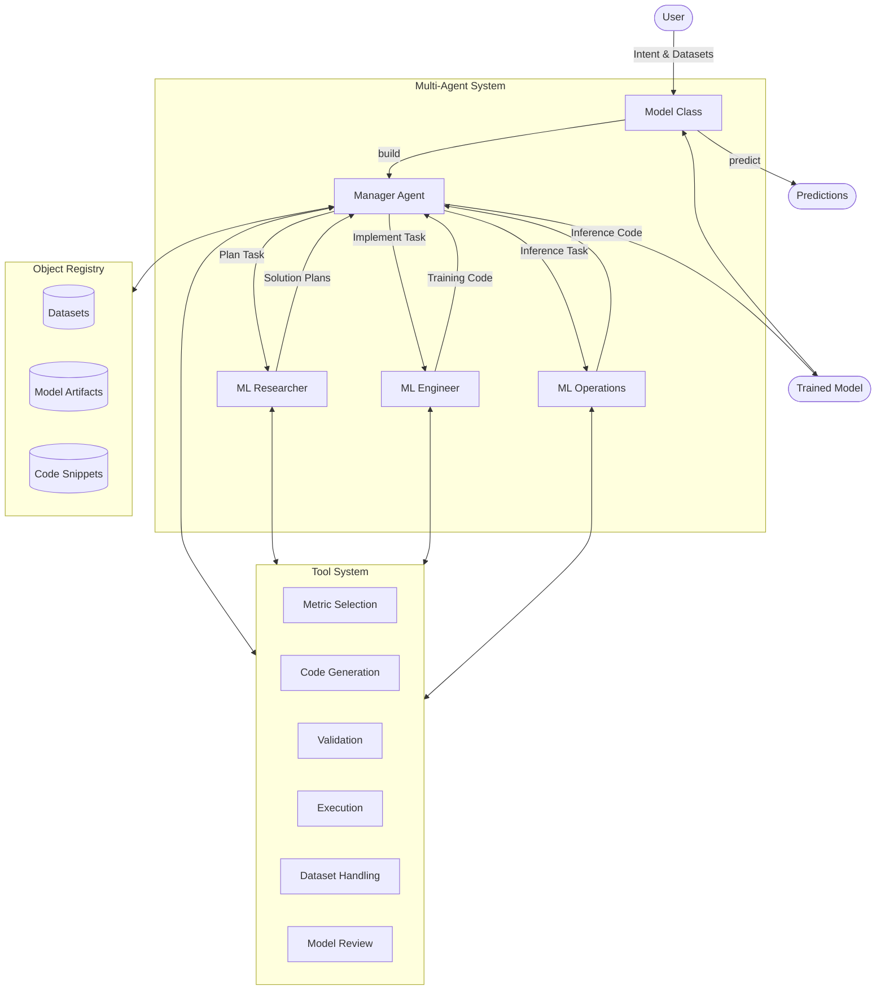

# Plexe Multi-Agent Architecture

<div align="center">

*A framework for autonomous machine learning using specialized agents*
</div>

## 📚 Table of Contents

- [Overview](#overview)
- [Architecture Diagram](#architecture-diagram)
- [Key Components](#key-components)
  - [Manager Agent (Orchestrator)](#manager-agent-orchestrator)
  - [ML Research Scientist Agent](#ml-research-scientist-agent)
  - [ML Engineer Agent](#ml-engineer-agent)
  - [ML Operations Engineer Agent](#ml-operations-engineer-agent)
  - [Object Registry](#object-registry)
  - [Tool System](#tool-system)
- [Workflow](#workflow)
- [Implementation Details](#implementation-details)
- [Extending the System](#extending-the-system)
- [References](#references)

## Overview

Plexe employs a sophisticated multi-agent architecture to automate the end-to-end machine learning development process. Instead of relying on a single large language model (LLM) to handle all aspects of ML development, Plexe uses a team of specialized agents, each designed for specific tasks in the ML lifecycle.

This approach offers several advantages:
- **Specialization**: Each agent focuses on what it does best
- **Modularity**: Components can be improved or replaced independently
- **Scalability**: The system can handle increasingly complex ML tasks
- **Explainability**: Clear separation of concerns helps trace decisions

## Architecture Diagram



## Key Components

### Manager Agent (Orchestrator)

**Class**: `PlexeAgent` attribute `manager_agent`  
**Type**: `CodeAgent`

The Manager Agent serves as the central coordinator for the entire ML development process:

```python
self.manager_agent = CodeAgent(
    name="Orchestrator",
    model=LiteLLMModel(model_id=self.orchestrator_model_id),
    tools=[select_target_metric, review_finalised_model, split_datasets, 
           create_input_sample, format_final_orchestrator_agent_response],
    managed_agents=[self.ml_research_agent, self.mle_agent, self.mlops_engineer],
    add_base_tools=False,
    verbosity_level=self.orchestrator_verbosity,
    additional_authorized_imports=config.code_generation.authorized_agent_imports,
    max_steps=self.max_steps,
    prompt_templates=get_prompt_templates("code_agent.yaml", "manager_prompt_templates.yaml"),
    planning_interval=7,
    step_callbacks=[self.chain_of_thought_callable],
)
```

**Responsibilities**:
- Initializing the problem based on user intent
- Selecting appropriate metrics
- Coordinating specialist agents
- Making decisions about which solution approach to pursue
- Collecting and integrating the final model artifacts

### ML Research Scientist Agent

**Class**: `PlexeAgent.ml_research_agent`  
**Type**: `ToolCallingAgent`

This agent specializes in solution planning and strategy:

```python
self.ml_research_agent = ToolCallingAgent(
    name="MLResearchScientist",
    description=(
        "Expert ML researcher that develops detailed solution ideas and plans for ML use cases. "
        "To work effectively, as part of the 'task' prompt the agent STRICTLY requires:"
        "- the ML task definition (i.e. 'intent')"
        "- input schema for the model"
        "- output schema for the model"
        "- the name and comparison method of the metric to optimise"
        "- the identifier of the LLM that should be used for plan generation"
    ),
    model=LiteLLMModel(model_id=self.ml_researcher_model_id),
    tools=[],
    add_base_tools=False,
    verbosity_level=self.specialist_verbosity,
    prompt_templates=get_prompt_templates("toolcalling_agent.yaml", "mls_prompt_templates.yaml"),
    step_callbacks=[self.chain_of_thought_callable]
)
```

**Responsibilities**:
- Analyzing the problem and available datasets
- Brainstorming possible ML approaches
- Developing detailed solution plans
- Providing rationales for suggested approaches

### ML Engineer Agent

**Class**: `PlexeAgent.mle_agent`  
**Type**: `ToolCallingAgent`

This agent handles the implementation and training of models:

```python
self.mle_agent = ToolCallingAgent(
    name="MLEngineer",
    description=(
        "Expert ML engineer that implements, trains and validates ML models based on provided plans. "
        "To work effectively, as part of the 'task' prompt the agent STRICTLY requires:"
        "- the ML task definition (i.e. 'intent')"
        "- input schema for the model"
        "- output schema for the model"
        "- the name and comparison method of the metric to optimise"
        "- the full solution plan that outlines how to solve this problem"
        "- the split train/validation dataset names"
        "- the working directory to use for model execution"
        "- the identifier of the LLM that should be used for code generation"
    ),
    model=LiteLLMModel(model_id=self.ml_engineer_model_id),
    tools=[
        generate_training_code,
        validate_training_code,
        fix_training_code,
        get_executor_tool(distributed),
        format_final_mle_agent_response,
    ],
    add_base_tools=False,
    verbosity_level=self.specialist_verbosity,
    prompt_templates=get_prompt_templates("toolcalling_agent.yaml", "mle_prompt_templates.yaml"),
    step_callbacks=[self.chain_of_thought_callable],
)
```

**Responsibilities**:
- Generating training code based on solution plans
- Training models and evaluating performance
- Handling data preprocessing
- Troubleshooting and fixing issues
- Creating model artifacts

### ML Operations Engineer Agent

**Class**: `PlexeAgent.mlops_engineer`  
**Type**: `ToolCallingAgent`

This agent focuses on productionizing the model through inference code:

```python
self.mlops_engineer = ToolCallingAgent(
    name="MLOperationsEngineer",
    description=(
        "Expert ML operations engineer that writes inference code for ML models to be used in production. "
        "To work effectively, as part of the 'task' prompt the agent STRICTLY requires:"
        "- input schema for the model"
        "- output schema for the model"
        "- the 'training code id' of the training code produced by the MLEngineer agent"
        "- the identifier of the LLM that should be used for code generation"
    ),
    model=LiteLLMModel(model_id=self.ml_ops_engineer_model_id),
    tools=[
        split_datasets,
        generate_inference_code,
        validate_inference_code,
        fix_inference_code,
        format_final_mlops_agent_response,
    ],
    add_base_tools=False,
    verbosity_level=self.specialist_verbosity,
    prompt_templates=get_prompt_templates("toolcalling_agent.yaml", "mlops_prompt_templates.yaml"),
    planning_interval=8,
    step_callbacks=[self.chain_of_thought_callable],
)
```

**Responsibilities**:
- Generating inference code for trained models
- Implementing model loading logic
- Creating input preprocessing and output postprocessing
- Validating inference code correctness

### Object Registry

**Class**: `ObjectRegistry`

The Object Registry provides a shared repository for storing and retrieving objects across the multi-agent system:

```python
class ObjectRegistry:
    """
    Registry for storing and retrieving objects by name.

    This class implements the Singleton pattern so that registry instances are shared
    across the application. It provides methods for registering, retrieving, and
    managing objects in a type-safe manner.
    """

    _instance = None
    _items = {}

    def __new__(cls):
        if cls._instance is None:
            cls._instance = super(ObjectRegistry, cls).__new__(cls)
            cls._items = {}
        return cls._instance
```

**Key Features**:
- Type-safe storage and retrieval
- Shared access across agents
- Registration of multiple item types (datasets, artifacts, code)

### Tool System

The system includes specialized tools that agents can use to perform specific tasks:

**Metric Selection Tool**:
```python
@tool
def select_target_metric(task: str, provider: str) -> Dict:
    """Selects the appropriate target metric to optimise for the given task."""
```

**Code Generation Tools**:
```python
@tool
def generate_training_code(
    task: str, solution_plan: str, train_datasets: List[str], 
    validation_datasets: List[str], llm_to_use: str
) -> str:
    """Generates training code based on the solution plan."""
```

**Validation Tools**:
```python
@tool
def validate_inference_code(
    inference_code: str, model_artifact_names: List[str],
    input_schema: Dict[str, str], output_schema: Dict[str, str],
) -> Dict:
    """Validates inference code for syntax, security, and correctness."""
```

**Execution Tools**:
```python
@tool
def execute_training_code(
    node_id: str, code: str, working_dir: str, dataset_names: List[str],
    timeout: int, metric_to_optimise_name: str, metric_to_optimise_comparison_method: str,
) -> Dict:
    """Executes training code in an isolated environment."""
```

## Workflow

The multi-agent workflow follows these key steps:

1. **Initialization**:
   - User creates a `Model` instance with intent and datasets
   - User calls `model.build()` to start the process

2. **Orchestration**:
   - Manager Agent selects metrics and splits datasets
   - Manager Agent initializes the solution planning phase

3. **Solution Planning**:
   - ML Research Scientist proposes solution approaches
   - Manager Agent evaluates and selects approaches

4. **Model Implementation**:
   - ML Engineer generates and executes training code
   - Model artifacts are registered in the Object Registry
   - Process may iterate through multiple approaches

5. **Inference Code Generation**:
   - ML Operations Engineer generates compatible inference code
   - Code is validated with sample inputs

6. **Finalization**:
   - Manager Agent reviews and finalizes the model
   - All artifacts and code are collected
   - Completed model is returned to the user

## Implementation Details

### Agent Communication

The system uses a hierarchical communication pattern:

```
User → Model → Manager Agent → Specialist Agents → Manager Agent → Model → User
```

Each agent communicates through structured task descriptions and responses:

```python
result = self.manager_agent.run(
    task=agent_prompt,
    additional_args={
        "intent": self.intent,
        "working_dir": self.working_dir,
        "input_schema": format_schema(self.input_schema),
        "output_schema": format_schema(self.output_schema),
        "provider": provider_config.tool_provider,
        "max_iterations": max_iterations,
        "timeout": timeout,
        "run_timeout": run_timeout,
    },
)
```

### Code Execution

The system executes generated code in isolated environments:

```python
class ProcessExecutor(Executor):
    """Execute Python code snippets in an isolated process."""

    def run(self) -> ExecutionResult:
        """Execute code in a subprocess and return results."""
        process = subprocess.Popen(
            [sys.executable, str(code_file)],
            stdout=subprocess.PIPE,
            stderr=subprocess.PIPE,
            cwd=str(self.working_dir),
            text=True,
        )
```

For distributed execution, a `RayExecutor` is available:

```python
class RayExecutor(Executor):
    """Execute Python code snippets on a Ray cluster."""
    
    @ray.remote
    def _run_code(code: str, working_dir: str, dataset_files: List[str], timeout: int) -> dict:
        """Ray remote function that executes the code."""
```

### Provider System

The `ProviderConfig` allows different LLMs for different agents:

```python
class ProviderConfig:
    """
    Configuration class for specifying different LLM providers for various agent roles.
    """

    def __init__(
        self,
        default_provider: str = "openai/gpt-4o-mini",
        orchestrator_provider: Optional[str] = None,
        research_provider: Optional[str] = None,
        engineer_provider: Optional[str] = None,
        ops_provider: Optional[str] = None,
        tool_provider: Optional[str] = None,
    ):
        # Default provider is used when specific ones aren't set
        self.default_provider = default_provider

        # Agent-specific providers
        self.orchestrator_provider = orchestrator_provider or default_provider
        self.research_provider = research_provider or default_provider
        self.engineer_provider = engineer_provider or default_provider
        self.ops_provider = ops_provider or default_provider

        # Provider for tool operations
        self.tool_provider = tool_provider or default_provider
```

## Extending the System

The multi-agent architecture in Plexe is designed to be extendable in several ways:

### Adding New Agents

You can create new specialized agents by extending the `PlexeAgent` class:

```python
class CustomPlexeAgent(PlexeAgent):
    def __init__(self, *args, **kwargs):
        super().__init__(*args, **kwargs)
        
        # Add a new specialized agent
        self.custom_agent = ToolCallingAgent(
            name="CustomAgent",
            description="Description of what this agent does",
            model=LiteLLMModel(model_id=self.custom_agent_model_id),
            tools=[custom_tool1, custom_tool2],
            add_base_tools=False,
            verbosity_level=self.specialist_verbosity,
            prompt_templates=get_prompt_templates("toolcalling_agent.yaml", "custom_prompt_templates.yaml"),
        )
        
        # Update manager agent to include new agent
        self.manager_agent.managed_agents.append(self.custom_agent)
```

### Implementing Custom Tools

You can add new tools by using the `@tool` decorator:

```python
@tool
def custom_tool(param1: str, param2: int) -> Dict:
    """Description of what this tool does."""
    # Tool implementation
    return {"result": "Output of the tool"}
```

### Supporting New Model Types

To support new model types, extend the execution and validation systems:

```python
class CustomModelValidator(Validator):
    """A validator for custom model types."""
    
    def validate(self, code: str, **kwargs) -> ValidationResult:
        # Validation logic for custom models
        pass
```

## References

- [PlexeAgent Class Definition](/plexe/internal/agents.py)
- [Model Class Definition](/plexe/models.py)
- [Tool Definitions](/plexe/internal/models/tools/)
- [Executor Implementation](/plexe/internal/models/execution/)